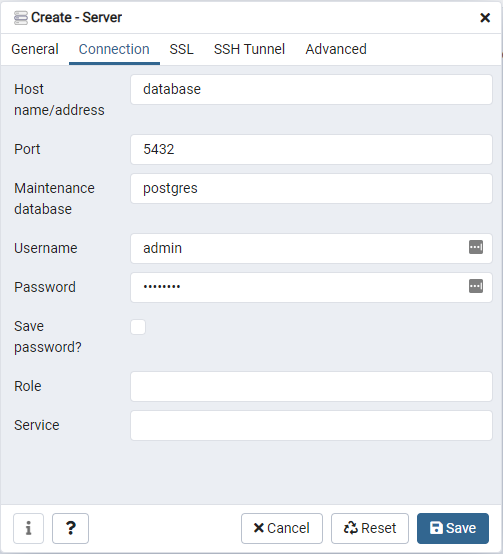

<!-- ABOUT THE PROJECT -->
## About The Project

This project the resolution of a challenge made by [Neoway](https://www.neoway.com.br/) whose goal was to find people with talent to join their team.

### Built With

* [Golang](https://golang.org/)
* [Postgres](https://www.postgresql.org/)
* [Pgadmin](https://www.pgadmin.org/)


<!-- GETTING STARTED -->
## Getting Started

### Prerequisites

For this project there is only one prerequisite, you must have Docker installed on your machine.
[HERE](https://docs.docker.com/get-docker/) is a link that will help you get it.

### Installation


1. Download or clone the repo
   ```sh
   git clone https://github.com/albertojnk/neoway-db-manipulation.git
   ```
3. Run Docker Compose
   ```sh
   docker-compose up
   ```

<!-- USAGE EXAMPLES -->
## Usage

The usage is very simple. After the project is up and running, send a request to the app with the base_teste.txt file.

example:
   ```sh
   curl --location --request POST 'http://localhost:8080/file' \
   --form 'file=@"/<path-to-file>/base_teste.txt"'
   ```

When you make this request, the server will parse the base_teste.txt data and save the data into a Postgres database.
To access this database is also very simple.

### Accessing the database via pgadmin

Access the pgadmin interface on http://localhost:5050/ and fill the credentials (the credentials can be found in .env)


After login you will need to create a server connection


Then change the config as the images below (username and password can also be found in .env)





Now you have full access of the database


<!-- LICENSE -->
## License

Distributed under the MIT License. See `LICENSE` for more information.


<!-- CONTACT -->
## Contact

Alberto Janicke - [@albertojnk](https://www.linkedin.com/in/alberto-janicke-b81b8b145/) - albertojanicke@live.com

Project Link: [https://github.com/your_username/repo_name](https://github.com/your_username/repo_name)
